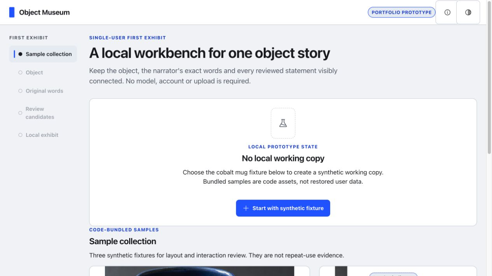

# Object Museum

Object Museum is a browser-local portfolio prototype for turning one object image and a narrator's own words into a source-grounded 2D exhibit. It demonstrates exact source spans, explicit narrator review, local persistence, and truthful clear boundaries without an account, API key, model call, telemetry, or external service.

> **Validate first.** This repository demonstrates an interaction and technical approach. It is not evidence of product demand, repeat use, family collaboration, production privacy, long-term preservation, or a validated “Museum.” Do not use real family or private material when evaluating it.



## What the prototype does

1. Starts from one of three clearly labeled synthetic fixtures.
2. Keeps the narrator's original text as an immutable, hashed source revision.
3. Proposes bounded, deterministic exact-text candidates.
4. Lets the narrator confirm, rewrite, reject, or mark each candidate uncertain.
5. Materializes a browser-local exhibit only from the current committed revision.
6. Lets the user reopen decisions or clear the working copy within an explicit browser-local boundary.

Optional user-selected audio is playback-only and stays local. It is never transcribed and never creates source spans. The repository distributes no audio fixture.

## Run locally

Requirements: Node.js 22 and npm.

```bash
npm ci
npm run dev
```

Vite binds to `127.0.0.1` and prints the local URL. For a production-shaped local preview:

```bash
npm run build
npm run preview
```

## Verify

```bash
npm run lint
npm run typecheck
npm test
npm run build
```

CI runs this full sequence on Node.js 22. The test suite covers domain invariants, storage/CAS behavior, media validation, React integration, keyboard paths, automated accessibility checks, and scope/security constraints. Repository-native Playwright/Cypress browser E2E is not included; the remaining manual browser acceptance gap is documented in [REVIEW.md](REVIEW.md) and [EXPERIENCE_ACCEPTANCE.md](EXPERIENCE_ACCEPTANCE.md).

## Scope boundaries

There is no share/public exhibit route, recipient view, second narrator, account, sync, backup/restore, export, timeline, 3D reconstruction, ASR, translation, model-generated prose, deployment configuration, or production privacy claim.

The app may store one working copy and its local media in IndexedDB. This storage is not encrypted by the app. Clearing the working copy cannot remove original files, screenshots, downloads, browser/device backups, or other copies. See [DATA_PRIVACY.md](DATA_PRIVACY.md) before using the prototype.

## Documentation

- [Architecture](ARCHITECTURE.md)
- [Data and privacy boundary](DATA_PRIVACY.md)
- [Known limitations and non-claims](KNOWN_LIMITATIONS.md)
- [Implementation decisions](IMPLEMENTATION_DECISIONS.md)
- [Verification summary](REVIEW.md)
- [10–15 minute experience acceptance](EXPERIENCE_ACCEPTANCE.md)
- [Asset provenance and rights](ASSET_LICENSES.md)
- [Third-party notices](THIRD_PARTY_NOTICES.md)

Additional views: [text-only story step](screenshots/story-no-audio-desktop-light.jpg), [exact-source review](screenshots/review-source-focus-desktop-light.jpg), [light exhibit](screenshots/exhibit-desktop-light.jpg), and [dark mobile exhibit](screenshots/exhibit-mobile-dark.jpg).

## Contributing and security

Contributions are welcome under [CONTRIBUTING.md](CONTRIBUTING.md). Never submit real personal, family, interview, or other private data in issues, pull requests, fixtures, tests, logs, or screenshots. Report vulnerabilities privately as described in [SECURITY.md](SECURITY.md).

## License

Code and ordinary documentation are © 2026 Kairui Liu and licensed under the [MIT License](LICENSE). The three AI-generated fixture images and their synthetic stories and metadata are offered under [CC0 1.0 Universal](LICENSES/CC0-1.0.txt), to the extent rights exist. See [ASSET_LICENSES.md](ASSET_LICENSES.md) for the exact boundary and AI/non-uniqueness disclosure.
